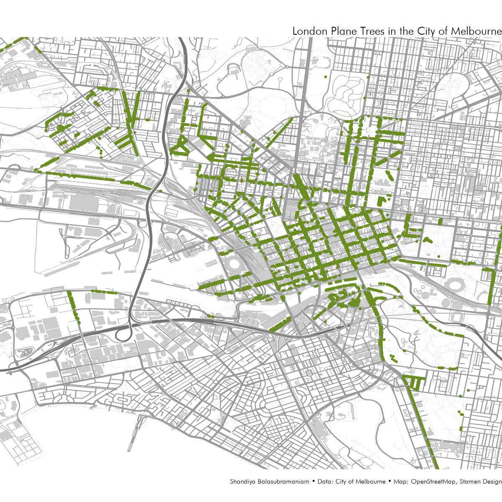
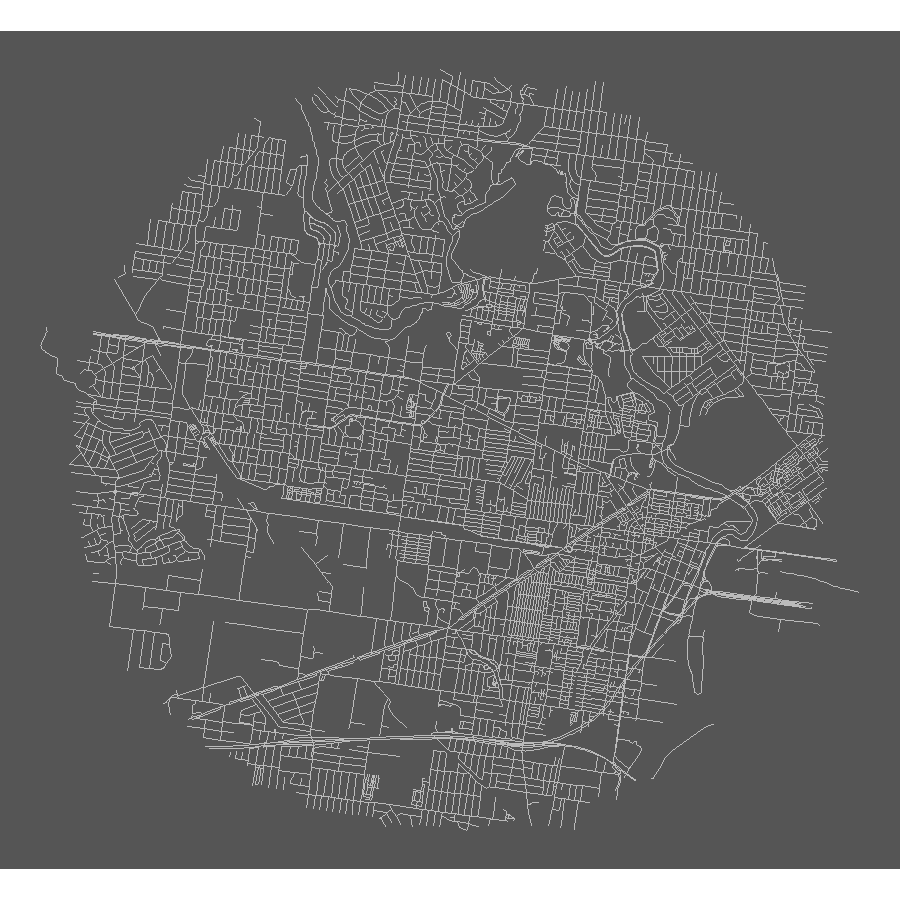
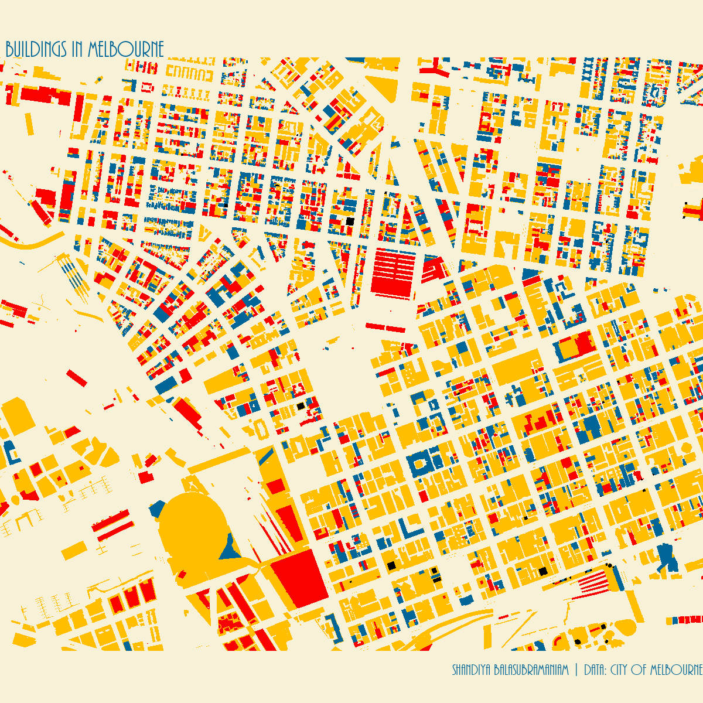
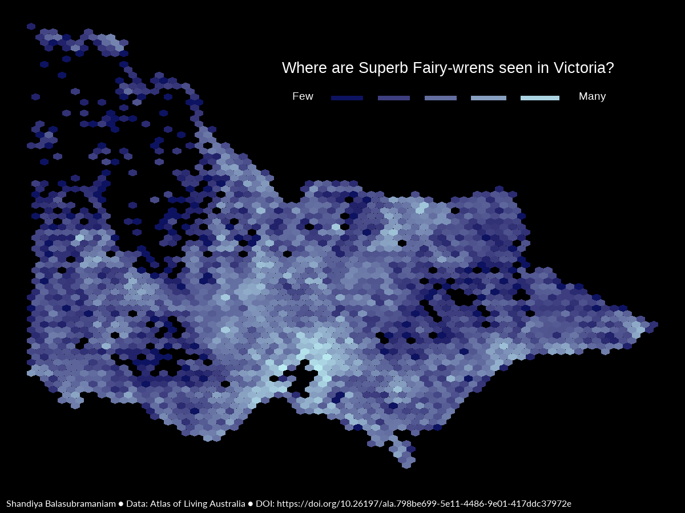
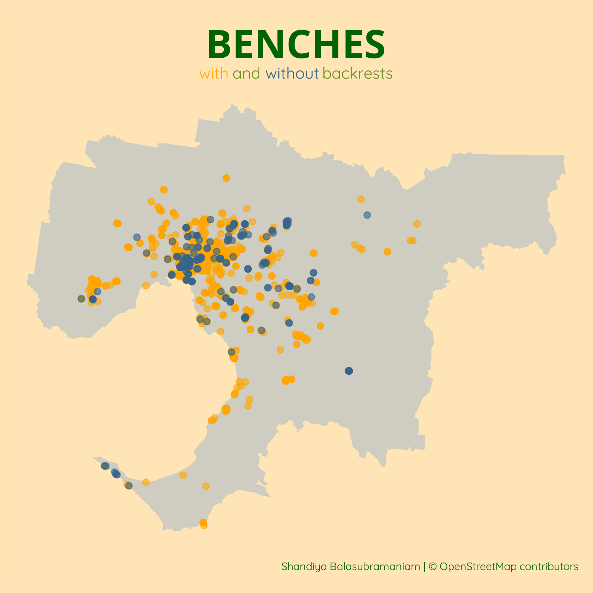
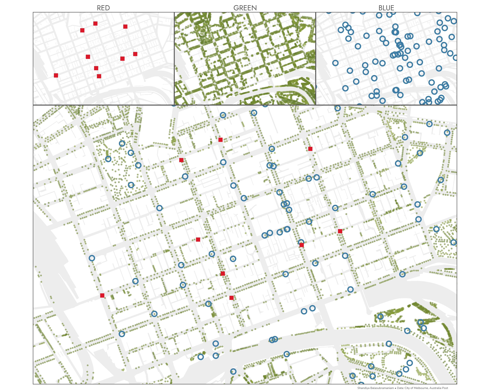
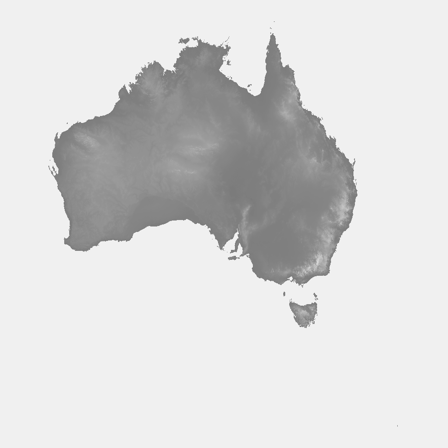

Submissions to the #30DayMapChallenge 2021  

### Day 1: Points  

{width=75%}

### Day 2: Lines  

{width=75%}

### Day 3: Polygons  

{width=75%} 

### Day 4: Hexagons  

{width=75%}

### Day 5: OpenStreetMap  

{width=75%} 

### Days 6-8: Red, Green, Blue  

{width=75%} 

### Day 9: Monochrome  

{width=75%} 

### Day 10: Raster  

{width=75%} 

